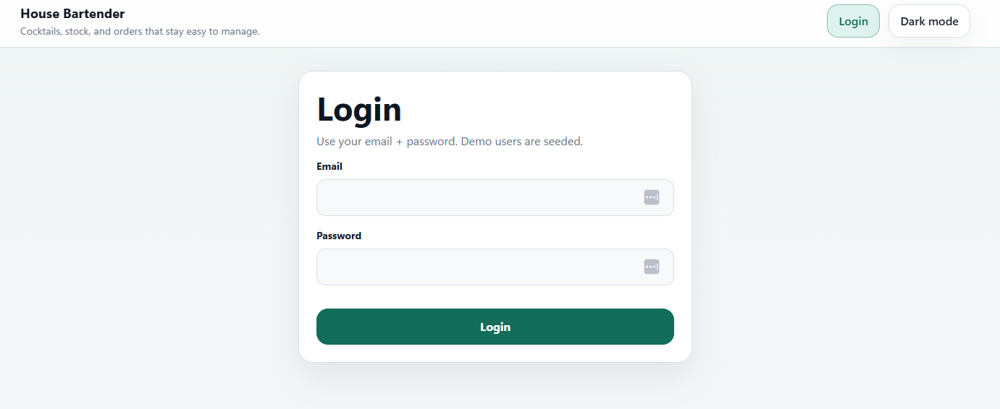
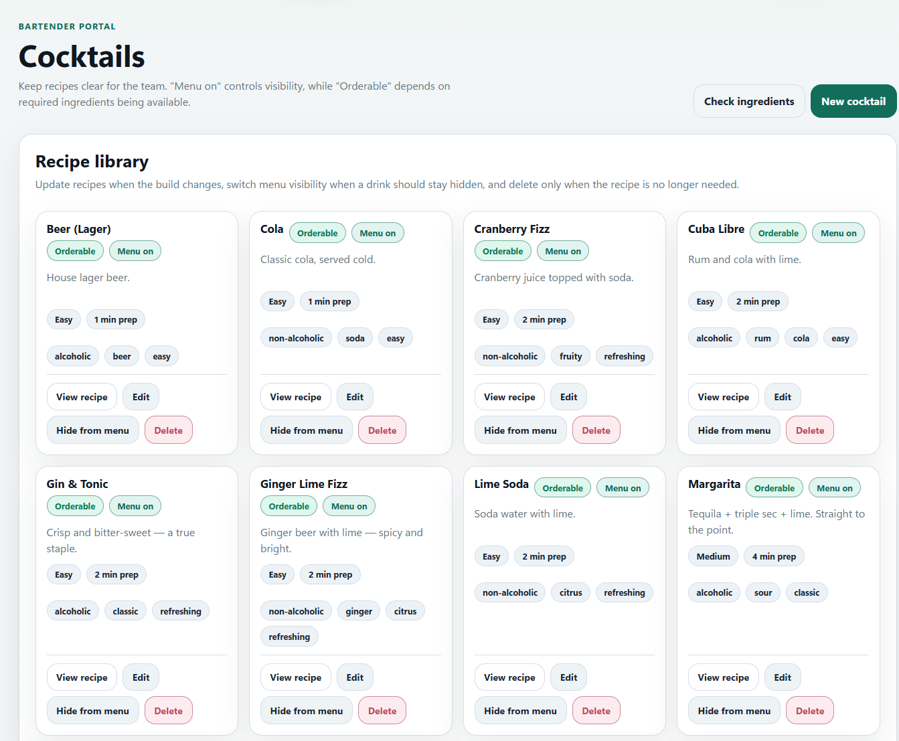
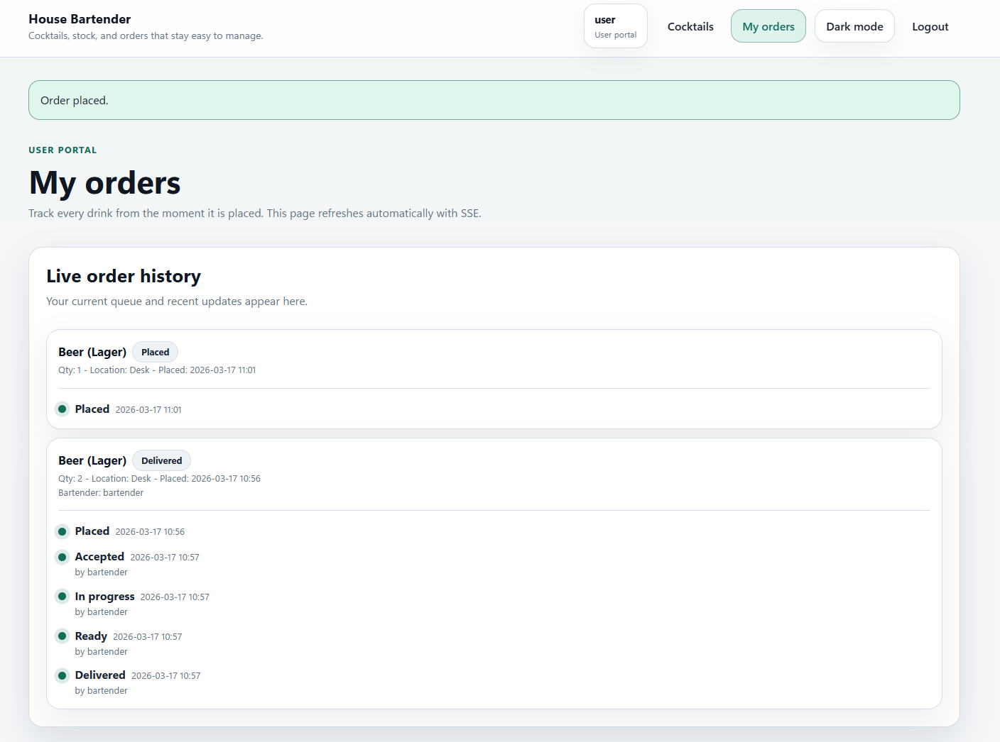
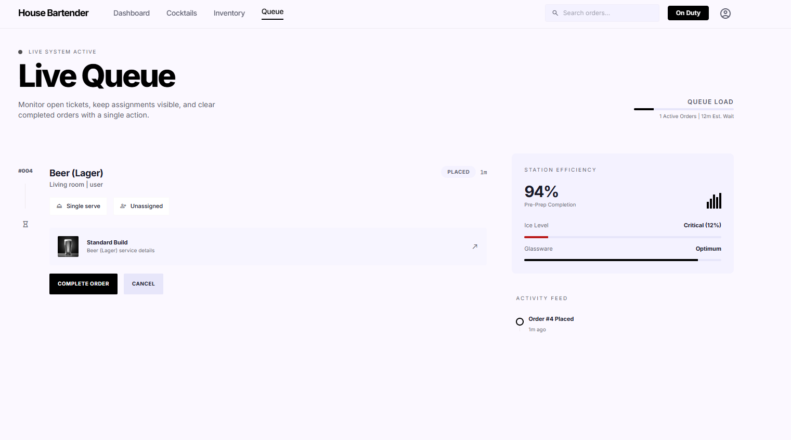

# House Bartender

House Bartender is a small self-hosted cocktail ordering app for home bars, private events, and day-to-day service workflows.

It keeps the stack simple:

- Go backend
- server-rendered HTML
- HTMX interactions
- SQLite persistence
- SSE live updates

Version `1.0.4` focuses on a reliable cocktail catalog view switch:

- fixed recipe library line/grid switching in bartender and admin views
- replaced single flip buttons with explicit line and grid view controls
- kept compact line view as the default cocktail layout across bartender and user catalogs
- preserved the faster stacked layouts and inline inventory workflow improvements from 1.0.3

## Table of contents

- [Highlights](#highlights)
- [Portals](#portals)
- [Tech stack](#tech-stack)
- [Quick start](#quick-start)
- [Environment](#environment)
- [First-time setup](#first-time-setup)
- [How availability works](#how-availability-works)
- [Development](#development)
- [Screenshots](#screenshots)
- [Troubleshooting](#troubleshooting)
- [Security notes](#security-notes)

## Highlights

- Browse only cocktails that are actually orderable right now.
- Manage ingredients, stock, and manual availability from the bartender inventory screen.
- Clear tracked stock back to blank and return to manual availability directly from inventory.
- Create and edit cocktails with recipe ingredients, instructions, and menu visibility controls.
- Switch cocktail browsing between default line view and optional grid view using explicit view buttons.
- Work the live order queue with assignment and status updates.
- Manage users, roles, passwords, and bartender duty from the admin portal.
- Use the app in light or dark mode, with the theme saved in `localStorage`.

## Portals

### User portal

- Browse available cocktails in default line view, with optional grid view
- Filter by alcohol, tags, and ingredient include/exclude rules
- View cocktail details and recipe notes
- Place orders with quantity, location, and notes
- Track order history and timeline updates

### Bartender portal

- View dashboard counts and newest order previews in a cleaner stacked layout
- Manage ingredient inventory and stock
- Mark ingredients available or unavailable directly from the list
- Create, edit, show, and hide cocktails from the menu
- Switch the cocktail library between default line view and optional grid view with explicit controls
- Run the live order queue with SSE updates

### Admin portal

- Create and manage accounts in the same aligned stacked layout used across admin screens
- Assign `USER`, `BARTENDER`, and `ADMIN` roles
- Enable or disable access
- Control bartender duty where it applies
- Run idempotent seed actions and review system details

## Tech stack

- Backend: Go
- UI: server-rendered templates + HTMX
- Database: SQLite
- Realtime: Server-Sent Events
- Auth: cookie sessions + role-based access
- Deployment: Docker / Docker Compose

## Quick start

### 1. Clone

```bash
git clone https://github.com/ihorsmi/house-bartender.git
cd house-bartender
```

### 2. Configure `.env`

Example:

```bash
SESSION_HASH_KEY_HEX=replace-with-64-hex-chars
SESSION_BLOCK_KEY_HEX=replace-with-64-hex-chars

BOOTSTRAP_ADMIN_EMAIL=admin@local
BOOTSTRAP_ADMIN_PASSWORD=change-me-strong
BOOTSTRAP_ADMIN_NAME=Admin

ADDR=:8080
BASE_URL=http://localhost:8080
DATA_DIR=/data
DB_PATH=/data/housebartender.db
UPLOAD_DIR=/data/uploads
```

If the session keys are missing, sessions may be reset on restart.

### 3. Start the app

```bash
docker compose up -d --build
docker compose logs -f app
```

Open `http://localhost:8080`.

## Environment

Common environment variables:

- `ADDR`: listen address, for example `:8080`
- `BASE_URL`: public base URL
- `DATA_DIR`: base data directory
- `DB_PATH`: SQLite database path
- `UPLOAD_DIR`: upload directory for images
- `SESSION_HASH_KEY_HEX`: required for stable sessions
- `SESSION_BLOCK_KEY_HEX`: optional encryption key if used by your session config
- `BOOTSTRAP_ADMIN_EMAIL`: bootstrap admin email
- `BOOTSTRAP_ADMIN_PASSWORD`: bootstrap admin password
- `BOOTSTRAP_ADMIN_NAME`: bootstrap admin display name

## First-time setup

There are two ways to create the first admin.

### Option A. Bootstrap by environment

If the bootstrap admin variables are set and no admin exists yet, the app creates the first admin automatically on startup.

### Option B. Use onboarding

If no admin exists and no bootstrap admin is configured, the app redirects to `/onboarding`.

## How availability works

### Ingredient availability

- If `stock_count` is set, availability follows stock and the ingredient is available only when `stock_count > 0`.
- If `stock_count` is blank, availability follows the manual `is_available` flag.

### Cocktail availability

A cocktail is orderable when:

- it is shown on the menu
- it is enabled for ordering
- all required ingredients are available

Optional recipe ingredients do not block ordering.

## Development

### Requirements

- Go 1.22+
- CGO support for `github.com/mattn/go-sqlite3`

### Run locally

```bash
go run ./cmd/housebartender
```

### Build locally

```bash
go build ./cmd/housebartender
```

### Test

```bash
go test ./...
```

## Screenshots

### Login

Polished entry screen with persistent theme toggle.



### User portal

Browse cocktails with the cleaned-up catalog layout.



Track placed, accepted, in-progress, ready, and delivered orders.



### Bartender portal

Work the live queue with assignment and status controls sized for fast service.



## Troubleshooting

### Sessions reset on restart

Set stable session keys in `.env`, especially `SESSION_HASH_KEY_HEX`.

### No cocktails appear for users

Check all of the following:

- the cocktail is shown on the menu
- the cocktail is enabled
- each required ingredient is available

### Database and uploads

By default in Docker:

- database: `/data/housebartender.db`
- uploads: `/data/uploads`

Back up `/data` before major upgrades.

## Security notes

This project is designed for home and internal self-hosted use.

If you expose it beyond your local network:

- run it behind TLS
- use strong admin credentials
- keep session keys secret
- restrict access at the proxy or network level
