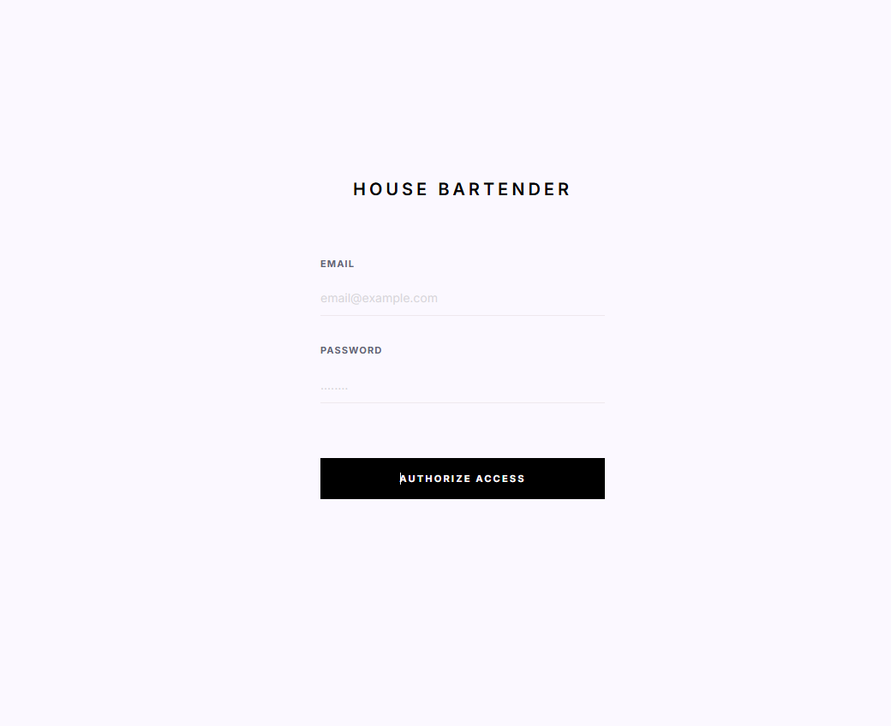
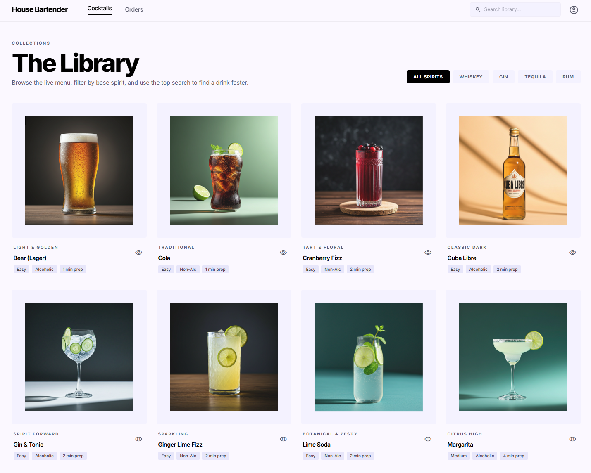
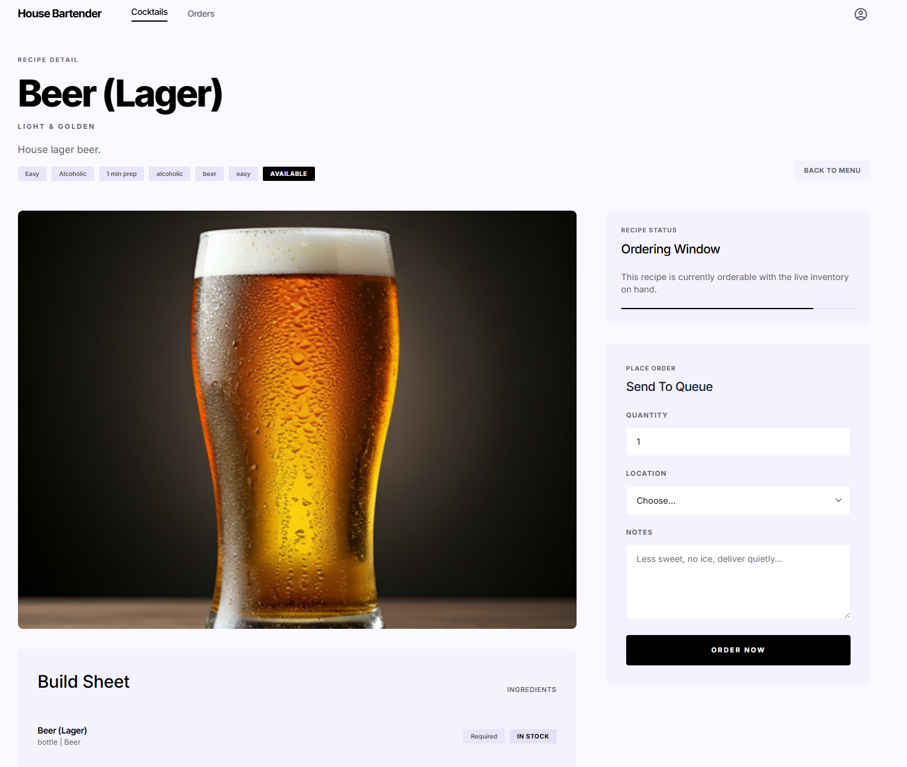
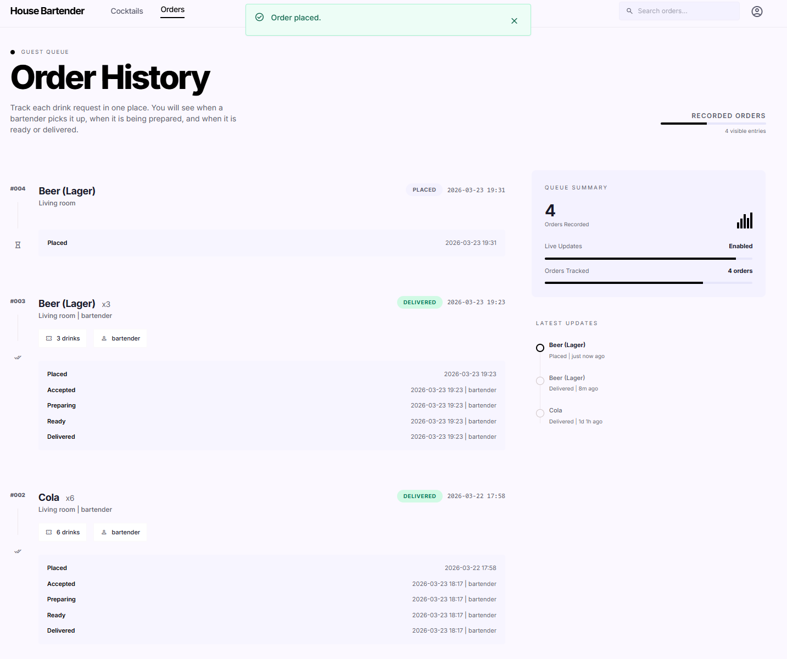
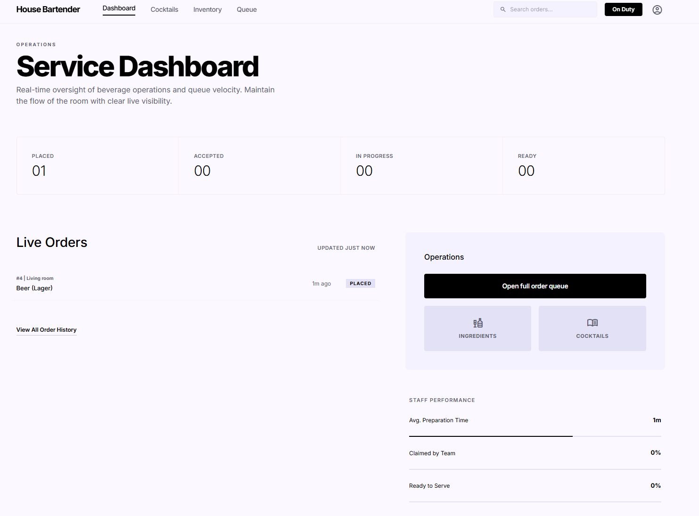
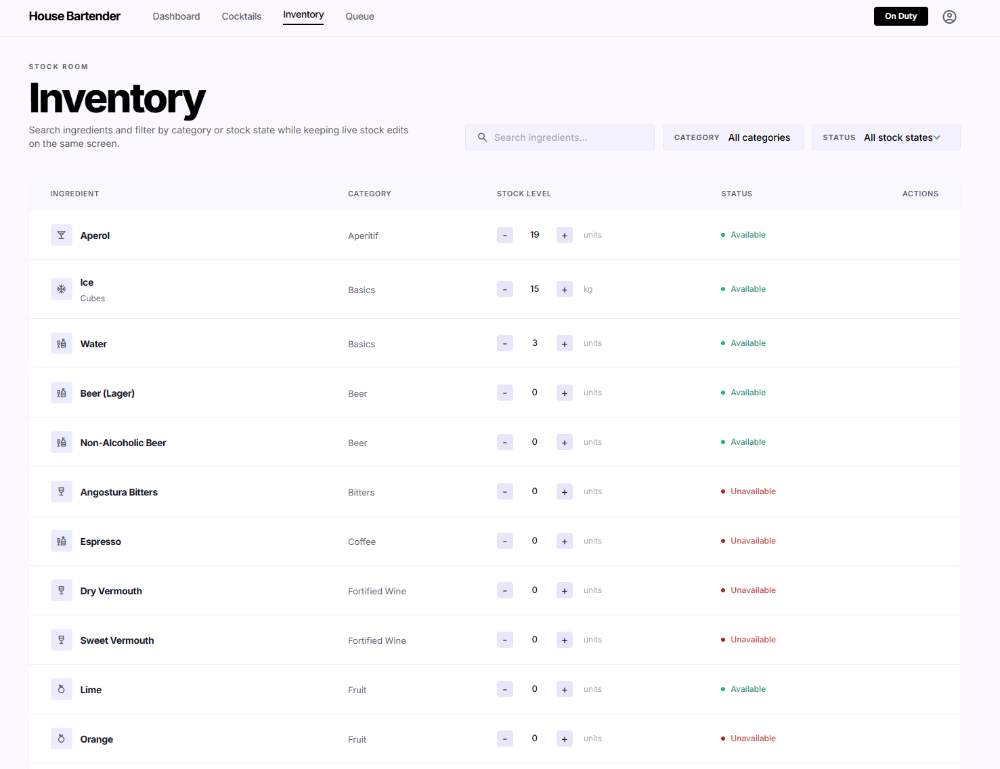
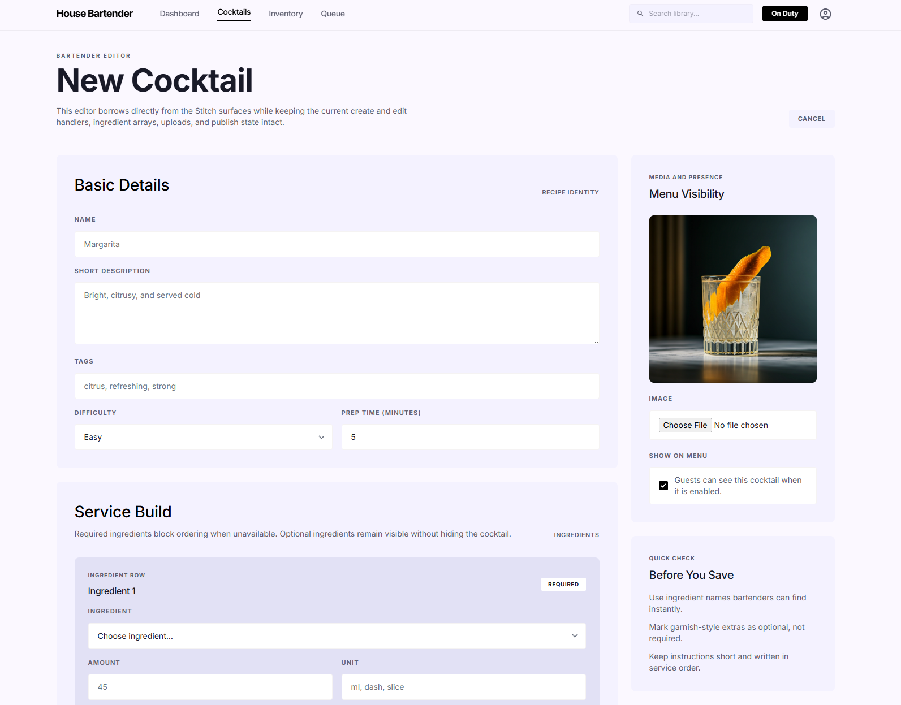
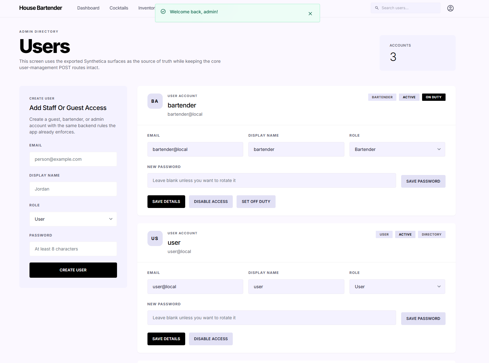

# House Bartender

House Bartender is a small self-hosted cocktail ordering app for home bars, private events, and day-to-day service workflows.

It keeps the stack simple:

- Go backend
- server-rendered HTML
- HTMX interactions
- SQLite persistence
- SSE live updates

Version `1.0.5` focuses on a full cross-portal refresh and a cleaner service workflow:

- unified the visual shell and typography across login, guest, bartender, and admin screens
- moved guest ordering into a dedicated cocktail detail page with clearer live status tracking
- redesigned bartender dashboard, queue, inventory, and cocktail editor flows for faster service
- aligned admin user and system control screens with the same management surfaces and navigation logic

## Table of contents

- [Highlights](#highlights)
- [Portals](#portals)
- [Tech stack](#tech-stack)
- [Quick start](#quick-start)
- [Environment](#environment)
- [First-time setup](#first-time-setup)
- [How availability works](#how-availability-works)
- [Development](#development)
- [Screenshots](#screenshots)
- [Troubleshooting](#troubleshooting)
- [Security notes](#security-notes)

## Highlights

- Browse only cocktails that are actually orderable right now, with spirit filters and shared search.
- Open a dedicated cocktail detail page before ordering, with ingredient visibility and availability status.
- Track guest orders with bartender assignment and status timeline updates.
- Run the bartender queue with a single `Complete Order` action while keeping event history intact.
- Manage inventory from a search-first stock room with inline stock controls and a streamlined editor.
- Create and edit cocktails with ingredient rules, uploads, instructions, and menu visibility controls.
- Manage users, roles, passwords, bartender duty, and system maintenance from aligned admin screens.
- Dismiss login, duty, and system flash notifications reliably across portals.

## Portals

### User portal

- Browse available cocktails with spirit filters and shared top-shell search
- Open recipe detail pages with hero imagery, ingredient status, and service notes
- Place orders with quantity, location, and notes
- Track order history with bartender assignment and status timeline updates

### Bartender portal

- View dashboard counts, queue preview, and service shortcuts in one shared shell
- Manage ingredient inventory from a search-first stock room with inline stock controls
- Create, edit, show, and hide cocktails from the menu with the redesigned editor
- Review the bartender library with shared search, spirit filters, and recipe detail pages
- Run the live order queue with SSE updates and a one-click completion flow

### Admin portal

- Create and manage accounts in the same aligned stacked layout used across admin screens
- Assign `USER`, `BARTENDER`, and `ADMIN` roles
- Enable or disable access
- Control bartender duty where it applies
- Run idempotent seed actions and review system details from `System Control`

## Tech stack

- Backend: Go
- UI: server-rendered templates + HTMX
- Database: SQLite
- Realtime: Server-Sent Events
- Auth: cookie sessions + role-based access
- Deployment: Docker / Docker Compose

## Quick start

### 1. Clone

```bash
git clone https://github.com/ihorsmi/house-bartender.git
cd house-bartender
```

### 2. Configure `.env`

Example:

```bash
SESSION_HASH_KEY_HEX=replace-with-64-hex-chars
SESSION_BLOCK_KEY_HEX=replace-with-64-hex-chars

BOOTSTRAP_ADMIN_EMAIL=admin@local
BOOTSTRAP_ADMIN_PASSWORD=change-me-strong
BOOTSTRAP_ADMIN_NAME=Admin

ADDR=:8080
BASE_URL=http://localhost:8080
DATA_DIR=/data
DB_PATH=/data/housebartender.db
UPLOAD_DIR=/data/uploads
```

If the session keys are missing, sessions may be reset on restart.

### 3. Start the app

```bash
docker compose up -d --build
docker compose logs -f app
```

Open `http://localhost:8080`.

## Environment

Common environment variables:

- `ADDR`: listen address, for example `:8080`
- `BASE_URL`: public base URL
- `DATA_DIR`: base data directory
- `DB_PATH`: SQLite database path
- `UPLOAD_DIR`: upload directory for images
- `SESSION_HASH_KEY_HEX`: required for stable sessions
- `SESSION_BLOCK_KEY_HEX`: optional encryption key if used by your session config
- `BOOTSTRAP_ADMIN_EMAIL`: bootstrap admin email
- `BOOTSTRAP_ADMIN_PASSWORD`: bootstrap admin password
- `BOOTSTRAP_ADMIN_NAME`: bootstrap admin display name

## First-time setup

There are two ways to create the first admin.

### Option A. Bootstrap by environment

If the bootstrap admin variables are set and no admin exists yet, the app creates the first admin automatically on startup.

### Option B. Use onboarding

If no admin exists and no bootstrap admin is configured, the app redirects to `/onboarding`.

## How availability works

### Ingredient availability

- If `stock_count` is set, availability follows stock and the ingredient is available only when `stock_count > 0`.
- If `stock_count` is blank, availability follows the manual `is_available` flag.

### Cocktail availability

A cocktail is orderable when:

- it is shown on the menu
- it is enabled for ordering
- all required ingredients are available

Optional recipe ingredients do not block ordering.

## Development

### Requirements

- Go 1.22+
- CGO support for `github.com/mattn/go-sqlite3`

### Run locally

```bash
go run ./cmd/housebartender
```

### Build locally

```bash
go build ./cmd/housebartender
```

### Test

```bash
go test ./...
```

## Screenshots

### Login

Minimal authorization screen for returning staff and admins. The main `Authorize Access` action keeps the entry flow direct and consistent with the rest of the release.



### User library

The guest-facing `The Library` screen now uses spirit chips such as `All Spirits`, `Whiskey`, `Gin`, `Tequila`, and `Rum` alongside shared search to surface live recipes faster.



### Cocktail detail and order form

Guests now order from a dedicated recipe detail page instead of a cramped inline card. The `Order Now` flow keeps quantity, location, notes, and ingredient availability together in one screen.



### User order history

The guest queue view now emphasizes bartender assignment and live status transitions, making it easier to see when a drink is picked up, prepared, ready, or delivered.



### Service dashboard

The bartender landing screen now combines live counts, order preview, and direct shortcuts into queue, inventory, and catalog work. It is designed to feel like an operations hub instead of a utility page.



### Live queue

`Live Queue` now keeps open tickets visible with a simpler action model. The key change is the single `Complete Order` action, which reduces bartender steps without dropping the event history guests see later.


### Inventory

The inventory screen is now search-first, with inline stock adjustments and a cleaner header. The floating `Add Ingredient` action keeps editor access close without crowding the table.



### Cocktail editor

The bartender editor now uses ingredient rows with `Required` and `Optional` rules, plus clearer save and publish actions. `Add Ingredient` and `Save Cocktail` are the core controls for building service-ready recipes.



### Admin users

The admin directory now presents account editing, role changes, password rotation, access toggles, and bartender duty controls in one consistent management surface.



## Troubleshooting

### Sessions reset on restart

Set stable session keys in `.env`, especially `SESSION_HASH_KEY_HEX`.

### No cocktails appear for users

Check all of the following:

- the cocktail is shown on the menu
- the cocktail is enabled
- each required ingredient is available

### Database and uploads

By default in Docker:

- database: `/data/housebartender.db`
- uploads: `/data/uploads`

Back up `/data` before major upgrades.

## Security notes

This project is designed for home and internal self-hosted use.

If you expose it beyond your local network:

- run it behind TLS
- use strong admin credentials
- keep session keys secret
- restrict access at the proxy or network level
